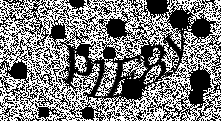
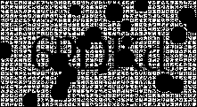
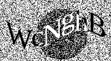
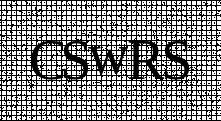

# CAPTCHA library written in Rust
[](https://travis-ci.org/daniel-e/captcha)
[](https://github.com/daniel-e/captcha/blob/master/LICENSE.md)
[](https://github.com/daniel-e/captcha/stargazers)
[](https://deps.rs/repo/github/daniel-e/captcha)

A library to generate CAPTCHAs like these:

 &nbsp;  &nbsp; 

### Requirements

Rust (https://www.rust-lang.org/)

### Documentation

https://docs.rs/captcha

## Usage

Add the following dependency to the `Cargo.toml` file:

```toml
[dependencies]
captcha = "*"
```

In your source file do:

```rust
extern crate captcha;

use captcha::Captcha;
use captcha::filters::Noise;
use std::path::Path;

fn main() {
    Captcha::new()
        .add_chars(5)
        .apply_filter(Noise::new(0.1))
        .view(220, 120)
        .save(Path::new("/tmp/captcha.png"))
        .expect("save failed");
}
```

## Running the example

    git clone git@github.com:daniel-e/captcha.git
    cd captcha
    cargo run --example captcha

This example creates 12 CAPTCHA images (PNG images) in the current directory.

The generated images will look like the following three images:

 &nbsp; 
&nbsp;
